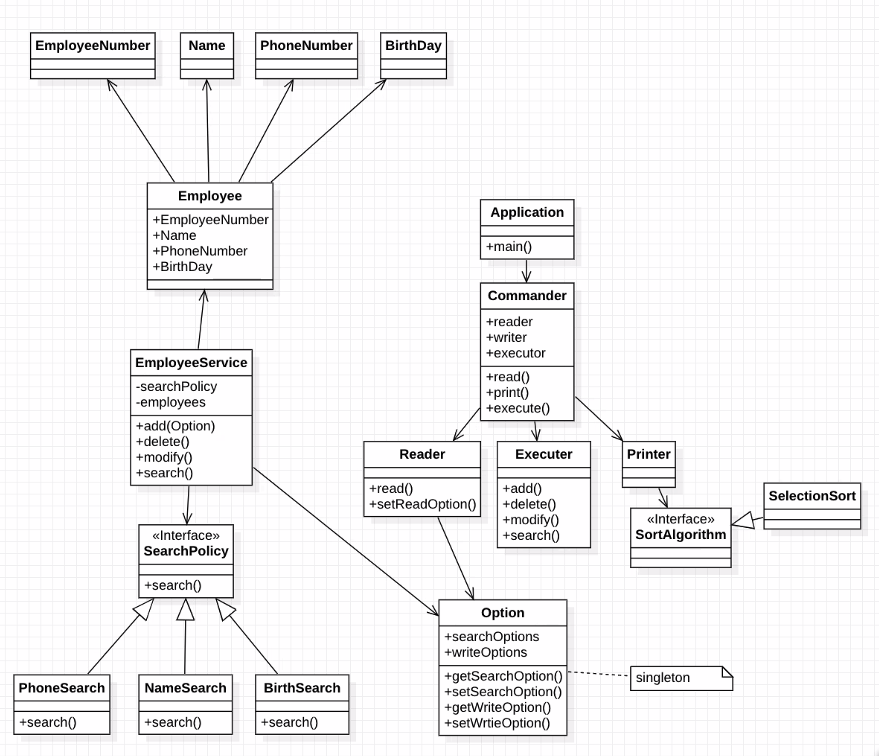

# CodeReviewAgent
코드 리뷰 팀 프로젝트

## :fire: 1. Best
- 목표를 설정해보자..!

 

## 🧑‍🤝‍🧑 2. Participants
|소속|이름|역할|brunch|
|------|---|---|----|
|삼성전자|도동훈|Reader, Executor, Printer 클래스|[dev_doh](https://github.com/dheldh77/Best/tree/dev_doh)|
|삼성전자|민유진|SearchPolicy 관련 클래스|[dev_yj](https://github.com/dheldh77/Best/tree/dev_yj)|
|삼성전자|이재효|Commander, EmployeeService 클래스|[dev_jaehyo](https://github.com/dheldh77/Best/tree/dev_jaehyo)|
|삼성전자|전승혁|Employee 클래스|[dev_jsh](https://github.com/dheldh77/Best/tree/dev_jsh)|
|삼성전자|김민석|Option 클래스|[dev_kms](https://github.com/dheldh77/Best/tree/dev_kms)|

 

## 👍 3. Code Review Rule
- 매일 가벼운 인사로 시작합니다.
- 1일 1커밋을 합니다.
- 코드리뷰를 받고 싶을 때 PR 시에 전반적인 설명을 적습니다.
- 코드리뷰는 1000 라인을 넘을 수 없습니다.
- 코드리뷰는 존중하는 마음으로 합니다.
- 개인의 코딩 스타일을 존중합니다.
- 네이밍에 대한 조언은 함수가 어떤 역할을 수행하는지 뚜렷하지 않을 떄 합니다.
- 코드리뷰는 실력이 좋은 사람이 하는 것이 아닙니다.

 

## 💻 4. PR Rule
- prefix는 클래스 명
- PR 시 간단한 설명
- 과반수 이상 승인 시에 Merge

 

## 🗒️ 5. SW process
### 1) 요구 사항 분석
- 사원 정보를 관리한다.
- 명령어를 입력받는다.
- 정보를 추가한다.
- 정보를 검색한다.
- 정보를 삭제한다.
- 정보를 수정한다.
- 정보를 출력한다.

 

### 2) 설계
> 작성 기능
- 메인 영역 (조립기 역할도 같이?)
- 회원 정보 클래스(Bean 클래스)
- 정보 추가/삭제/수정
- 정보 검색(옵션에 따른 하위 콘크리트 클래스 구현)
- 명령어 입력 / 정보 출력 ?
- 옵션 관리 클래스
- 소팅 알고리즘 관련 클래스
- 검색기능을 위해서 사원구조체 객체참조할수있는 해쉬구조체

 

> Class Diagram

 

> Class Interface
- [Class Interface](https://github.com/dheldh77/Best/blob/dev_kms/DesignDocumetation/methodSignature.md)

 

## 📘 5. Reference
- [Groud Rule](https://app.sli.do/event/bE61HmGBotM1S8qv1BtLS2/live/polls)
- [Sprint](https://carnation-belief-5ee.notion.site/bf110aee0db8430bad07e9a0378b1cbf?v=5506304380b84935a5c6a0923827244b)
- [OOP_Design_pattern_ref](https://carnation-belief-5ee.notion.site/3-Architect-Design-680ae934fd0044a3908c3dfc7b53d9ec)
